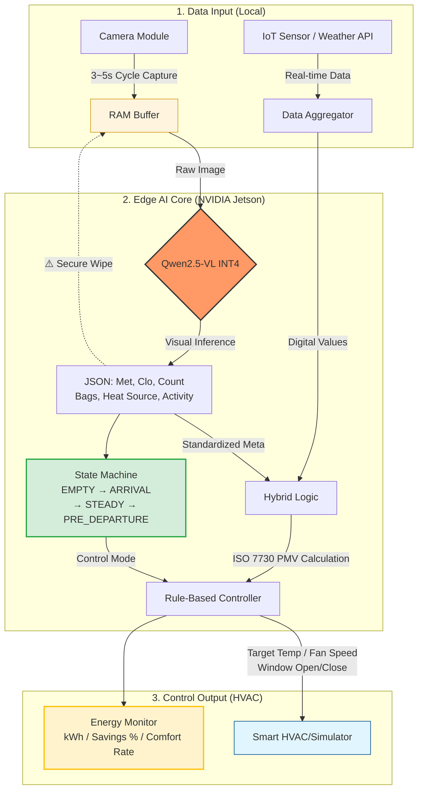

# 📄 엣지 VLM 및 IoT 융합 기반 완전 오프라인 지능형 공조(HVAC) 제어 시스템 PRD

## 1. 프로젝트 요약 (Executive Summary)
본 프로젝트는 소형 임베디드 보드(NVIDIA Jetson)의 제한된 리소스 내에서 시각-언어 모델(VLM)을 최적화하여 구동하는 **스탠드얼론(Standalone) 스마트 공조 제어 시스템**을 개발합니다. 외부 클라우드 네트워크 연결 없이 기기 내부에서 실내 상황(재실자 수, 착의량, 활동량)을 자체적으로 인지함으로써 네트워크 지연 및 사생활 침해 문제를 원천 차단합니다. 단순한 온도 센서 의존을 넘어, 재실자의 **'열 쾌적성(PMV)'을 선제적으로 예측**하여 에너지를 절감하는 산업용 **레트로핏(Retrofit) 솔루션**을 제안합니다.

---

## 2. 프로젝트 목표 (Project Objectives)
- **오프라인 엣지 VLM 파이프라인 구축:** 카메라 이미지로부터 공간의 복합적인 맥락(Context)을 파악하는 VLM을 엣지 디바이스에 포팅하고, **INT4 양자화 및 TensorRT 가속화**를 통해 실시간 추론 성능을 확보합니다.
- **하이브리드 자율 제어 시스템 구현:** VLM이 추출한 비정형 공간 상황 데이터(정성적)와 IoT 센서가 측정한 기기 상태 데이터(정량적)를 융합하여, 쾌적성을 극대화하면서도 전력 소모를 최소화하는 **ISO 7730 기반 지능형 제어 로직**을 완성합니다.

---

## 3. 👥 주요 이해관계자 및 팀 정보
### 3.1 주요 이해관계자
- **프로젝트 팀 (Project Team):** 시스템 아키텍처 설계, AI 모델 최적화, 테스트 및 통합 배포를 책임지는 핵심 개발 그룹입니다.
- **최종 사용자 (End-Users):** 시스템이 설치된 상업 및 업무 공간(피트니스 센터, 스마트 오피스 등)의 재실자입니다. (열 쾌적성 향상 및 프라이버시 완벽 보장 요구)
- **시설 관리자 및 비즈니스 소유주:** 공조 시스템을 도입하여 유지보수 비용(OPEX)을 절감하고자 하는 운영 주체입니다. (에너지 절감 ROI, 설치 용이성 중시)
- **B2B 고객:** 막대한 설비 교체 비용 없이 레트로핏 솔루션을 통해 기존 인프라를 지능화하고자 하는 기업 고객입니다.

### 3.2 팀 정보 (Team Information)
- **2143619 김준경** / **2144007 김철호** / **2343804 김민서** / **2343967 정윤찬**

---

## 4. 핵심 차별성 (Key Features)

### ① 완전 오프라인 엣지 AI (Privacy-Preserving)
- **차별점:** 카메라 이미지는 외부 서버로 전송되지 않으며, RAM 내부에서 1회성 추론 후 즉시 **Zero-fill 삭제(Secure Wipe)** 처리됩니다.
- **기대효과:** 지연(Latency) 없는 즉각 처리 및 보안 구역에서도 사생활 침해 제로(0)를 보장합니다.

### ② 비전 기반 열 쾌적성(PMV) 추정 시스템
- **차별점:** 기존 센서로 측정 불가한 재실자의 **착의량(Clo, 옷의 두께), 활동량(Met, 움직임의 강도)** 등을 VLM이 종합 시각 인지합니다.
- **기대효과:** 온도가 올라간 후 작동하는 '후행 제어'가 아닌, 불쾌감을 느끼기 전 대응하는 **'선제적 제어'**로 에너지를 효율적으로 관리합니다.

### ③ VLM + IoT 하이브리드 아키텍처 (연산 최적화)
- **차별점:** VLM의 연산력을 단순 숫자 인식에 낭비하지 않고, 비정형 공간 맥락 인식에 100% 집중시킵니다.
- **기대효과:** 온도 및 설정값은 가벼운 IoT 통신으로 수집하여 RAM 점유율을 방어하고 시스템 안정성을 극대화합니다.

### ④ 시계열 상태 머신 (Context-Aware State Control)
- **차별점:** 단순 온도 센서와 달리 **'지금 어떤 상황인가'**를 시간 흐름 속에서 추적합니다. 도착 직후(ARRIVAL) → 안정 운전(STEADY) → 퇴근 준비(PRE_DEPARTURE) → 빈 공간(EMPTY) 4단계로 제어 모드를 전환합니다.
- **기대효과:** 출근 직후 빠른 냉·난방, 퇴근 전 선제 절전, 빈 공간 자동 OFF로 불필요한 에너지 낭비를 제거합니다.

### ⑤ 에너지 절약 정량화 및 실시간 모니터링
- **차별점:** 전통 방식(항상 Fan 2 가동) 대비 실제 소비 전력량을 매 스텝 누적 비교하여 **절약률(%)** 을 실시간 산출합니다.
- **기대효과:** 논문 및 보고서용 정량 데이터(kWh, 절약률, PMV 쾌적 유지율) 자동 수집으로 시스템 효과를 객관적으로 증명합니다.

---

## 5. 특화 적용 시나리오 (Application Scenarios)

- **시나리오 A: 다이내믹 피트니스 센터 (구역별 맞춤 제어)**
    - **문제점:** 구역별 활동량 차이가 극심하나 중앙 에어컨은 평균 온도만 측정함.
    - **솔루션:** 러닝머신 구역(High Met)과 스트레칭 구역(Low Met)을 시각 구분하여 국소적으로 풍량을 집중 제어함.
- **시나리오 B: 상업용 조리 시설 (센서 지연 극복 선제적 제어)**
    - **문제점:** 열기가 천장 센서에 닿기까지 수 분의 타임랙(Time-lag) 발생.
    - **솔루션:** VLM이 화구 점화 및 수증기를 즉각 인지하여 물리적 온도 상승 전 냉방/환기를 최대 출력으로 사전 가동함.
- **시나리오 C: 스마트 오피스 트랜지션 (공간 맥락 인지 에너지 절감)**
    - **문제점:** 퇴실 후에야 센서가 반응하여 빈 방에 불필요한 에너지 소비 발생.
    - **솔루션:** 외투 착용, 가방 정리 등 '퇴근 준비 맥락' 포착 시 인원이 남았어도 잔열/냉기를 활용하도록 공조기를 선제 종료함.

---

## 6. 🏗 시스템 아키텍처 및 데이터 흐름

### 6.1 시스템 흐름도 (Mermaid)

### 6.2 하드웨어 및 소프트웨어 스택
- **하드웨어:** **NVIDIA Jetson Orin Nano Super (8GB)** - TensorRT 가속 및 8GB UMA를 활용한 오프라인 구동 최적화.
- **소프트웨어:** **Qwen2.5-VL (3B)** - 경량 파라미터 기반의 정교한 시각 인지 및 JSON 파싱 능력 활용.
- **데이터 파이프라인:** `이미지 캡처 → VLM 추론 → 맥락 추출(Met/Clo/Bags/HeatSource) → 원본 파기 → IoT 융합 → 상태 머신 갱신 → PMV 엔진 → Rule-Based 제어 명령 → 에너지 누적 기록`.
- **신규 파일:** `state_machine.py` (4단계 상태 전이 + 퇴근 맥락 점수), `energy_monitor.py` (소비전력 누적 + 베이스라인 비교).

---

## 7. 상업화 전략 및 비즈니스 기대효과
- **레거시 인프라의 스마트화 (Retrofit):** 구형 공조기기에 엣지 보드 부착만으로 최신 AI 솔루션 도입 가능 (프랜차이즈 시장 진입 장벽 완화).
- **즉각적인 ROI 및 ESG 경영:** 공조 에너지 15~20% 절감을 통한 도입 비용 조기 회수 및 탄소 배출 저감 기여.
- **공간 데이터 수익화 (Data Monetization):** 비식별 텍스트 데이터(고객 밀집도, 체류 시간 등)를 분석 대시보드 형태로 점주에게 제공하는 SaaS 모델 확장.

---

## 🚀 8. 16주 개발 마일스톤 (16-Week Roadmap)

### Part 1: 기반 구축 및 VLM 프로토타이핑 (Weeks 1-4)
- **1-2주:** 주제 선정, 기술 스택 확정 및 PRD 구체화
- **3주:** PC 기반 개발 환경 구축, VLM(Qwen2.5-VL) 모델 성능 및 리소스 점유율 테스트
- **4주:** 도메인 특화 VLM 프롬프트 엔지니어링 및 출력 데이터 JSON 정규화(Parsing)

### Part 2: 엣지 디바이스 배포 및 최적화 (Weeks 5-8)
- **5주:** NVIDIA Jetson Orin Nano 개발 보드 OS/환경 설정 (JetPack-6.0)
- **6주:** Jetson 보드 환경으로 VLM 모델 포팅 및 오프라인 로컬 추론 테스트
- **7주:** 모델 경량화(INT4 양자화 적용) 전후 메모리 및 성능 비교
- **8주:** **TensorRT 엔진 변환**을 통한 추론 속도(FPS) 극대화 작업

### Part 3: IoT 연동 및 파이프라인 통합 (Weeks 9-12)
- **9주:** 가상 IoT 센서 및 액추에이터 통신 모듈 개발 (Digital Twin 환경 구축)
- **10주:** VLM 텍스트 데이터와 IoT 센서 데이터 융합 및 **ISO 7730 PMV 기반 제어 로직** 구현
- **11주:** 전체 파이프라인(카메라 -> VLM -> 융합 -> 제어) 통합 및 엔드투엔드(E2E) 실증 테스트
- **12주:** 중간 발표 진행 및 피드백 기반 아키텍처 개선

### Part 4: 고도화 및 최종 마무리 (Weeks 13-16)
- **13주:** 시스템 연속 구동 안정성 확보 및 예외 처리(Exception Handling) 로직 추가
- **14주:** 관리자 모니터링용 웹 대시보드 UI/UX 프로토타입 구현
- **15주:** 최종 산출물 기반 프로젝트 문서화(보고서) 및 데모 발표 자료 제작
- **16주:** 최종 발표(디펜스) 진행 및 GitHub 리포지토리 코드 회고 정리

---

## 9. 라이선스 (License)
본 프로젝트는 [LICENSE](LICENSE) 파일에 명시된 라이선스 정책을 따릅니다.