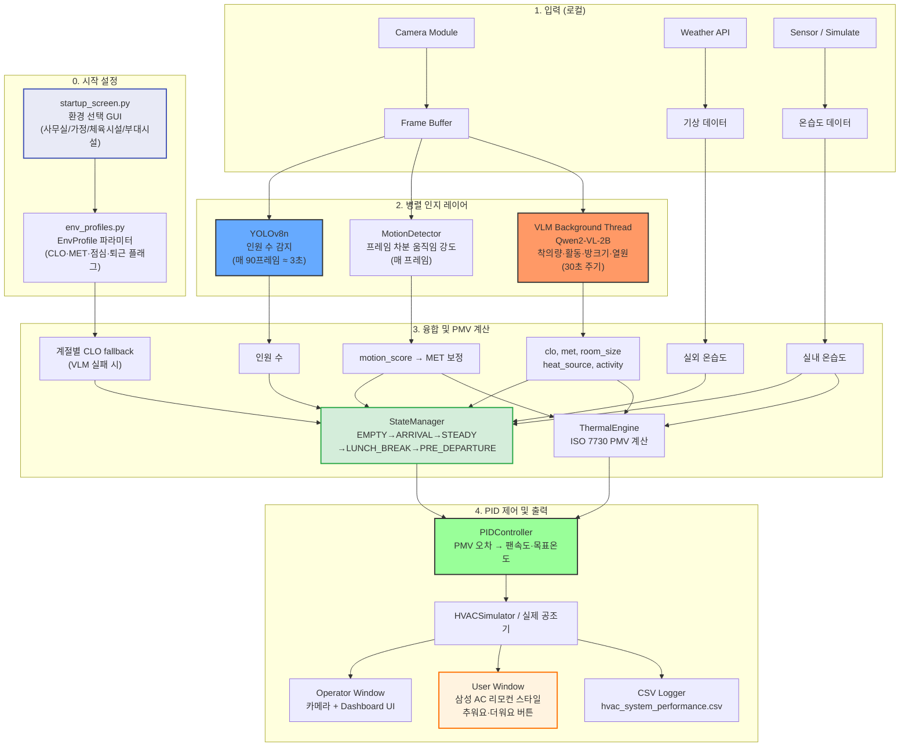

# 엣지 VLM 및 IoT 융합 기반 완전 오프라인 지능형 공조(HVAC) 제어 시스템

## 1. 프로젝트 요약 (Executive Summary)
본 프로젝트는 소형 임베디드 보드(NVIDIA Jetson)의 제한된 리소스 내에서 시각-언어 모델(VLM)을 최적화하여 구동하는 **스탠드얼론(Standalone) 스마트 공조 제어 시스템**을 개발합니다. 외부 클라우드 네트워크 연결 없이 기기 내부에서 실내 상황(착의량, 활동량, 맥락 신호)을 자체적으로 인지함으로써 네트워크 지연 및 사생활 침해 문제를 원천 차단합니다. 단순한 온도 센서 의존을 넘어, 재실자의 **'열 쾌적성(PMV)'을 선제적으로 예측**하여 에너지를 절감하는 산업용 **레트로핏(Retrofit) 솔루션**을 제안합니다.

---

## 2. 프로젝트 목표 (Project Objectives)
- **오프라인 엣지 AI 파이프라인 구축:** 카메라 이미지로부터 공간의 복합적인 맥락(Context)을 파악하는 VLM을 엣지 디바이스에 포팅하고, **INT4 양자화 및 TensorRT 가속화**를 통해 실시간 추론 성능을 확보합니다.
- **하이브리드 자율 제어 시스템 구현:** VLM(착의량·활동 분류)·YOLOv8n(인원 감지)·MotionDetector(움직임 강도)가 추출한 데이터와 IoT 센서의 온습도 데이터를 융합하여, **ISO 7730 기반 PMV 쾌적성 지수**를 실시간 계산하고 PID 제어기로 공조기를 정밀 제어합니다.

---

## 3. 👥 주요 이해관계자 및 팀 정보
### 3.1 주요 이해관계자
- **프로젝트 팀 (Project Team):** 시스템 아키텍처 설계, AI 모델 최적화, 테스트 및 통합 배포를 책임지는 핵심 개발 그룹입니다.
- **최종 사용자 (End-Users):** 시스템이 설치된 상업 및 업무 공간(피트니스 센터, 스마트 오피스 등)의 재실자입니다. (열 쾌적성 향상 및 프라이버시 완벽 보장 요구)
- **시설 관리자 및 비즈니스 소유주:** 공조 시스템을 도입하여 유지보수 비용(OPEX)을 절감하고자 하는 운영 주체입니다. (에너지 절감 ROI, 설치 용이성 중시)
- **B2B 고객:** 막대한 설비 교체 비용 없이 레트로핏 솔루션을 통해 기존 인프라를 지능화하고자 하는 기업 고객입니다.

### 3.2 팀 정보 (Team Information)
| 학번 | 이름 | 역할 |
|------|------|------|
| 2143619 | 김준경 | VLM / AI 추론 |
| 2144007 | 김철호 | PM / 시스템 통합 |
| 2343804 | 김민서 | 열환경 모델링 |
| 2343967 | 정윤찬 | 데이터 / 에너지 분석 |

---

## 4. 핵심 차별성 (Key Features)

### ① 완전 오프라인 엣지 AI (Privacy-Preserving)
- **차별점:** 카메라 이미지는 외부 서버로 전송되지 않으며, RAM 내부에서 1회성 추론 후 즉시 처리됩니다.
- **기대효과:** 지연(Latency) 없는 즉각 처리 및 보안 구역에서도 사생활 침해 제로(0)를 보장합니다.

### ② YOLO + VLM 하이브리드 인지 시스템
- **차별점:** 인원 수 감지는 YOLOv8n(95%+ 정확도, 10~20fps)이 전담하고, VLM(Qwen2-VL-2B)은 착의량(Clo)·활동 분류(Met)·방 크기·열원 등 **정성적 공간 맥락 인지**에만 집중합니다. VLM 분석 사이 구간에는 MotionDetector가 프레임 차분으로 실제 움직임 강도를 측정해 MET를 실시간 보정합니다.
- **기대효과:** 각 모델을 적재적소에 배치하여 정확도와 연산 효율을 동시에 최대화합니다.

### ③ PMV 기반 PID 제어 (정밀 쾌적 제어)
- **차별점:** 단순 if/else 온도 임계값 제어 대신 **ISO 7730 PMV 오차를 PID 제어기(kp=0.8, ki=0.05, kd=0.3)** 에 입력하여 팬 속도와 목표 온도를 연속적으로 계산합니다.
- **기대효과:** 오랫동안 추웠던 공간은 적분항이 보정하고, 급격한 온도 변화는 미분항이 억제하여 오버슈트 없이 쾌적 구간에 안착합니다.

### ④ 시계열 상태 머신 + 맥락 인지 (Context-Aware State Control)
- **차별점:** EMPTY → ARRIVAL → STEADY → LUNCH_BREAK → PRE_DEPARTURE **5단계** 상태로 제어 모드를 자동 전환합니다.
  - **LUNCH_BREAK:** 점심 시간대(기본 12~13시) 인원 0 감지 시 AC를 OFF하고 대기합니다. 인원 복귀 시 ARRIVAL로 전환하여 집중 냉·난방을 재개합니다.
  - **PRE_DEPARTURE:** 외투 착용·인원 감소 등 '퇴근 준비 맥락 점수(최대 75점)' 기반으로 인원이 남아 있어도 선제 절전합니다.
  - **계절별 CLO 자동 적용:** VLM 추론 실패 시 사용 환경 프로파일(봄가을/여름/겨울)에 따라 착의량(CLO)을 자동 설정합니다. 예: 헬스장은 계절 무관 CLO 0.4~0.5, 사무실 겨울은 1.2.
- **기대효과:** 출근 직후 빠른 냉·난방, 점심 공실 자동 절전 후 복귀 시 재가동, 퇴근 전 선제 절전으로 상황 맥락에 맞는 에너지 운용이 가능합니다.

### ⑤ 사용 환경 프로파일 선택 (Startup Environment Selector)
- **차별점:** 시스템 시작 시 **사무실 / 가정 / 체육시설 / 부대시설** 환경을 GUI 카드 화면에서 선택합니다. 선택된 프로파일에 따라 점심 감지 여부, 퇴근 맥락 감지 여부, MET 기준값, 계절별 CLO가 자동 설정됩니다.
- **기대효과:** 단일 시스템 코드로 운영 환경에 맞는 최적 파라미터를 자동 적용하며, 헬스장처럼 점심 휴무·퇴근 개념이 없는 공간에서도 오탐 없이 동작합니다.

### ⑥ 이중 창 UI + PMV 선호도 버튼
- **차별점:** 운영자 창(카메라 + 대시보드)과 사용자 창(삼성 시스템 에어컨 벽면 리모컨 스타일)을 분리합니다. 사용자 창의 **추워요 / 더워요** 버튼 클릭으로 PMV 선호도(±0.5 단계)를 실시간 조정합니다.
- **기대효과:** 재실자가 키보드 없이 터치/클릭 한 번으로 개인 쾌적도를 반영할 수 있으며, 운영자는 별도 창에서 센서·AI 분석 정보를 모니터링합니다.

### ⑦ 센서 추상화 레이어 (Jetson 이전 용이성)
- **차별점:** `sensor_interface.py`의 `MODE` 변수 하나만 바꾸면 (`simulate` → `dht22` / `bme280`) Jetson 하드웨어 센서로 전환됩니다. 나머지 모든 코드는 수정 불필요합니다.
- **기대효과:** 노트북 개발 환경과 Jetson 운영 환경 사이의 이전 비용을 최소화합니다.

---

## 5. 특화 적용 시나리오 (Application Scenarios)

- **시나리오 A: 다이내믹 피트니스 센터 (구역별 맞춤 제어)**
    - **문제점:** 구역별 활동량 차이가 극심하나 중앙 에어컨은 평균 온도만 측정함.
    - **솔루션:** VLM이 활동 종류(exercising/standing)와 MotionDetector가 실제 움직임 강도를 감지하여 MET 보정, PID 제어기가 팬 속도를 세밀하게 조절함.
- **시나리오 B: 상업용 조리 시설 (센서 지연 극복 선제적 제어)**
    - **문제점:** 열기가 천장 센서에 닿기까지 수 분의 타임랙(Time-lag) 발생.
    - **솔루션:** VLM이 열원(heat_source) 즉각 인지 → 복사온도(tr) 보정 + 환기 우선 제어.
- **시나리오 C: 스마트 오피스 트랜지션 (공간 맥락 인지 에너지 절감)**
    - **문제점:** 퇴실 후에야 센서가 반응하여 빈 방에 불필요한 에너지 소비 발생.
    - **솔루션:** 외투 착용, 인원 감소 등 '퇴근 준비 맥락' 포착 시 PRE_DEPARTURE 상태로 전환하여 공조기를 선제 절전함.

---

## 6. 🏗 시스템 아키텍처 및 데이터 흐름

### 6.1 시스템 흐름도



### 6.2 모듈 구성

| 파일 | 역할 |
|------|------|
| `main.py` | 메인 루프, 스레딩 조율, 이중 창 관리, 마우스 콜백, 키 입력 처리 |
| `env_profiles.py` | 사용 환경 프로파일 정의 (사무실·가정·체육시설·부대시설) — CLO·MET·점심·퇴근 파라미터 |
| `startup_screen.py` | 시작 시 환경 선택 GUI — 호버 효과 + 클릭 선택, ESC → 사무실 기본값 |
| `user_display.py` | 사용자 창 UI — 삼성 시스템 AC 리모컨 스타일, 추워요·더워요 버튼, PMV 선호도 표시 |
| `vlm_processor.py` | Qwen2-VL-2B 추론 — clo/met/room_size/heat_source/activity 추출 |
| `yolo_detector.py` | YOLOv8n 인원 감지 — 매 90프레임(≈3초), YOLO 불가 시 -1 반환 |
| `motion_detector.py` | 프레임 차분 + 롤링 평균 → motion_score → MET 보정 |
| `pid_controller.py` | PMV 오차 기반 PID 제어 (kp=0.8, ki=0.05, kd=0.3, deadband=0.12) |
| `thermal_engine.py` | ISO 7730 PMV 계산 엔진 |
| `state_machine.py` | 5단계 상태 전이 (EMPTY·ARRIVAL·STEADY·LUNCH_BREAK·PRE_DEPARTURE) + 퇴근 맥락 점수 (최대 75점) |
| `hvac_simulator.py` | 공조기 시뮬레이터 (난방/냉방 물리 모델, 기본 25°C 난방) |
| `sensor_interface.py` | 온습도 센서 추상화 (simulate / dht22 / bme280) |
| `energy_monitor.py` | 소비전력 누적 모듈 — 현재 메인 루프에서 미사용, 향후 하드웨어 연동 시 활성화 예정 |
| `weather_service.py` | 기상청(KMA) 초단기실황 API — 온도·습도·날씨·풍속 취득 (60초 주기) |
| `air_quality_service.py` | 에어코리아 API — PM10/PM2.5/KHAI 취득 (60초 주기) |
| `dashboard.py` | PIL 기반 운영자 대시보드 (실외환경·PM2.5·상태머신·수동제어 표시, 한글 폰트 자동 감지) |
| `convert_tensorrt.py` | Jetson TRT 변환 유틸리티 (YOLO FP16 / Qwen2-VL INT4) |
| `virtual_ac.py` | 고급 물리 기반 AC 시뮬레이터 (RoomThermalModel + CompressorUnit + WindowAdvisor) — 향후 통합 예정 |

### 6.3 데이터 파이프라인

```
[시작] startup_screen.py → 환경 선택 (사무실/가정/체육시설/부대시설)
         └─ env_profiles.py EnvProfile 로드
              (점심 감지 여부, 퇴근 감지 여부, MET 기준값, 계절별 CLO)

카메라 프레임 (30fps)
  ├─ YOLOv8n  (매 90프레임 ≈ 3초) → 인원 수
  ├─ MotionDetector (매 프레임) → motion_score → MET 보정
  └─ VLM Thread (30초 주기)
       └─ Qwen2-VL-2B → clo / met / room_size / heat_source / activity
            (VLM 미가동 시 → 계절별 CLO fallback from EnvProfile)

기상청 API (60초 주기) → 실외 온도·습도·날씨·풍속
에어코리아 API (60초 주기) → PM10 / PM2.5 / 통합대기환경지수(KHAI)

융합 → StateManager 갱신
       (EMPTY → ARRIVAL → STEADY → LUNCH_BREAK → PRE_DEPARTURE)
       (점심 시간대 인원 0 → LUNCH_BREAK, 복귀 시 → ARRIVAL)
  → ThermalEngine PMV 계산 (adjusted_pmv = pmv - 사용자선호도)
  → PIDController (STEADY) 또는 규칙 기반 (ARRIVAL/PRE_DEPARTURE/LUNCH_BREAK/EMPTY)
  → HVACSimulator 제어 명령
  → [운영자 창] 카메라 + Dashboard 렌더링
  → [사용자 창] AC 리모컨 UI (추워요·더워요 버튼)
  → CSV 기록 (hvac_system_performance.csv)
```

### 6.4 하드웨어 및 소프트웨어 스택

- **타겟 하드웨어:** NVIDIA Jetson Orin Nano Super (8GB) — TensorRT 가속 + 8GB UMA
- **개발 환경:** 노트북 CPU (simulate 모드) / Apple Silicon M5 MPS 가속 지원
- **VLM 모델:** `Qwen/Qwen2-VL-2B-Instruct` — float32(CPU) / float16(MPS·CUDA)
- **인원 감지:** `ultralytics YOLOv8n` — imgsz=320(CPU) / 640+TRT(Jetson)
- **디바이스 자동 선택:** MPS → CUDA → CPU 우선순위 자동 감지

---

## 7. 🚀 빠른 시작

```bash
# 의존성 설치 (Mac)
pip install torch torchvision
pip install -r requirements_mac.txt

# 실행 (기본 30초 VLM 주기)
python main.py

# M5 Mac 권장 (MPS 가속)
python main.py --interval 10

# Jetson TRT 변환 (Jetson에서 실행)
python convert_tensorrt.py --all
```

**환경 변수 설정 (`.env` 파일):**
```
WEATHER_API_KEY=기상청_API_키
AIR_QUALITY_API_KEY=에어코리아_API_키
AIR_QUALITY_STATION=장림동
```

**실행 흐름:**
1. 시작 시 환경 선택 GUI 표시 → 카드 클릭 or ESC(사무실 기본값)
2. **운영자 창** (좌): 카메라 영상 + 대시보드 (센서·AI·상태 정보)
3. **사용자 창** (우): AC 리모컨 스타일 UI — **추워요 / 더워요 버튼 클릭**으로 PMV 선호도 조정

**운영자 창 키 입력:**
- `s` — 즉시 VLM 분석 실행
- `w` — 창문 열기/닫기 토글
- `q` — 종료
- `m` — 수동/자동 모드 전환
  - (수동 모드) `p` — 전원 ON/OFF
  - (수동 모드) `c` / `h` — 냉방 / 난방 전환
  - (수동 모드) `+` / `-` — 설정 온도 ±1°C
  - (수동 모드) `f` — 팬 속도 순환 (1→2→3→1)

**사용자 창 버튼 (마우스 클릭):**
- `추워요` — PMV 선호도 +0.5 (더 따뜻하게)
- `더워요` — PMV 선호도 -0.5 (더 시원하게)

---

## 8. 상업화 전략 및 비즈니스 기대효과
- **레거시 인프라의 스마트화 (Retrofit):** 구형 공조기기에 엣지 보드 부착만으로 최신 AI 솔루션 도입 가능 (프랜차이즈 시장 진입 장벽 완화).
- **즉각적인 ROI 및 ESG 경영:** 공조 에너지 15~20% 절감을 통한 도입 비용 조기 회수 및 탄소 배출 저감 기여.
- **공간 데이터 수익화 (Data Monetization):** 비식별 텍스트 데이터(고객 밀집도, 체류 시간 등)를 분석 대시보드 형태로 점주에게 제공하는 SaaS 모델 확장.

---

## 9. 16주 개발 마일스톤 (16-Week Roadmap)

### Part 1: 기반 구축 및 VLM 프로토타이핑 (Weeks 1-4)
- **1-2주:** 주제 선정, 기술 스택 확정 및 PRD 구체화
- **3주:** PC 기반 개발 환경 구축, VLM(Qwen2-VL-2B) 모델 성능 및 리소스 점유율 테스트
- **4주:** 도메인 특화 VLM 프롬프트 엔지니어링 및 출력 데이터 JSON 정규화(Parsing)

### Part 2: 엣지 디바이스 배포 및 최적화 (Weeks 5-8)
- **5주:** NVIDIA Jetson Orin Nano Super 개발 보드 OS/환경 설정 (JetPack 6.0)
- **6주:** Jetson 환경으로 VLM 모델 포팅 및 오프라인 로컬 추론 테스트
- **7주:** YOLOv8n TRT FP16 변환 + Qwen2-VL INT4 양자화 적용, 메모리·성능 비교
- **8주:** TensorRT 엔진 변환을 통한 추론 속도(FPS) 극대화 (`convert_tensorrt.py`)

### Part 3: IoT 연동 및 파이프라인 통합 (Weeks 9-12)
- **9주:** DHT22/BME280 하드웨어 센서 연결 (`sensor_interface.py` MODE 전환)
- **10주:** VLM+YOLO+MotionDetector 융합 및 PID 제어 파인튜닝
- **11주:** 전체 파이프라인 통합 E2E 실증 테스트 (Jetson 기준 5~10초 분석 주기)
- **12주:** 중간 발표 진행 및 피드백 기반 아키텍처 개선

### Part 4: 고도화 및 최종 마무리 (Weeks 13-16)
- **13주:** 시스템 연속 구동 안정성 확보 및 예외 처리 로직 보강
- **14주:** 에너지 리포트 및 데이터 분석 (CSV → 시각화)
- **15주:** 최종 산출물 기반 프로젝트 문서화(보고서) 및 데모 발표 자료 제작
- **16주:** 최종 발표(디펜스) 진행 및 GitHub 리포지토리 코드 회고 정리

---

## 10. 라이선스 (License)
본 프로젝트는 [LICENSE](LICENSE) 파일에 명시된 라이선스 정책을 따릅니다.
