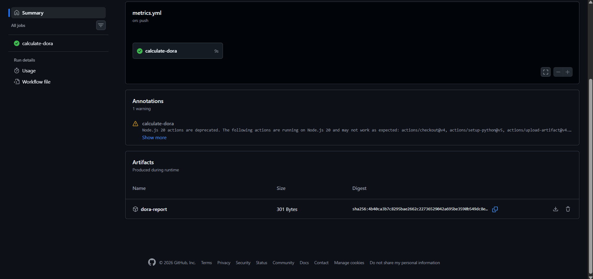

# [Week 2] DORA Metrics 수집 자동화

GitHub Actions를 활용해 DORA 4대 지표를 **실제 GitHub API 데이터 기반**으로 자동 수집합니다.

## 📊 DORA 4대 지표

| 지표 | 설명 | 수집 방법 |
|------|------|-----------|
| 🚀 Deployment Frequency | 배포 빈도 (최근 7일 main 커밋 수) | GitHub Commits API |
| ⏱ Lead Time for Changes | PR 생성 → 머지까지 평균 소요 시간 | GitHub Pulls API |
| 🔥 Change Failure Rate | fix/hotfix/bug PR 비율 | GitHub Pulls API |
| 🛠 MTTR | bug 라벨 이슈 처리 평균 시간 | GitHub Issues API |

## ⚙️ 워크플로우 구성

- **트리거**: main 브랜치 push / PR 머지 / 매주 월요일 자동 실행 / 수동 실행
- **수집**: Python 스크립트로 GitHub API 호출 → `dora_metrics.json` 생성
- **저장**: GitHub Actions Artifact로 업로드
- **리포트**: 주간 자동 Issue 생성 (schedule/수동 실행 시)

## 🗂 산출물

- `.github/workflows/metrics.yml` — 자동화 워크플로우
- `week2/collect_metrics.py` — DORA 메트릭 수집 Python 스크립트
- `week2/dora_metrics.json` — 수집된 메트릭 (워크플로우 실행 후 생성)

## 📸 실행 결과

