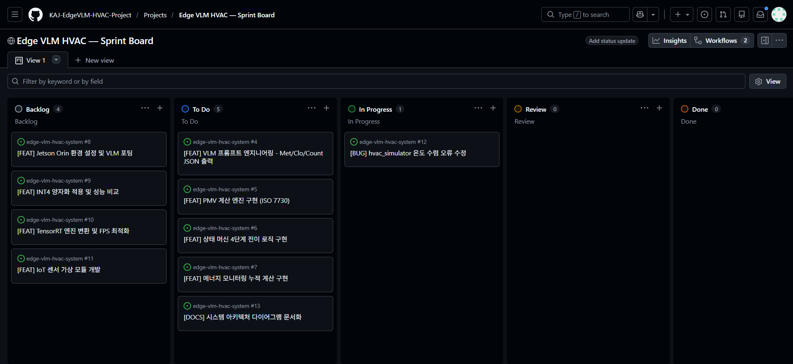

# [Week 3] GitHub Projects 계획·추적 체계 구축

## 📋 Project Board

칸반 기반 스프린트 보드를 구성하여 프로젝트 전체 이슈를 추적합니다.

- **Board**: [Edge VLM HVAC — Sprint Board](https://github.com/orgs/KAJ-EdgeVLM-HVAC-Project/projects)
- **컬럼 구성**: 📋 Backlog / 📌 To Do / 🔨 In Progress / 👀 Review / ✅ Done

## 🏷 라벨 체계

| 라벨 | 용도 |
|------|------|
| `bug` | 버그/오류 |
| `enhancement` | 새 기능 |
| `documentation` | 문서 관련 |
| `vlm` | VLM 관련 작업 |
| `hvac` | HVAC 제어 관련 |
| `ci/cd` | 자동화 관련 |
| `priority:high` | 높은 우선순위 |
| `priority:low` | 낮은 우선순위 |
| `dora-report` | DORA 자동 리포트 |
| `needs-triage` | 분류 필요 |

## 🎯 마일스톤

| 마일스톤 | 기한 | 설명 |
|----------|------|------|
| v0.1 — VLM 프로토타입 | 2026-04-30 | PC 기반 VLM 추론 및 기본 파이프라인 구축 |
| v0.2 — Jetson 배포 및 통합 | 2026-06-20 | Jetson 포팅, IoT 연동, 전체 파이프라인 통합 |

## 📌 이슈 백로그 (10개)

| # | 제목 | 라벨 | 마일스톤 | 상태 |
|---|------|------|----------|------|
| #4 | VLM 프롬프트 엔지니어링 - Met/Clo/Count JSON 출력 | `vlm`, `enhancement` | v0.1 | To Do |
| #5 | PMV 계산 엔진 구현 (ISO 7730) | `hvac`, `enhancement` | v0.1 | To Do |
| #6 | 상태 머신 4단계 전이 로직 구현 | `hvac`, `enhancement` | v0.1 | To Do |
| #7 | 에너지 모니터링 누적 계산 구현 | `hvac`, `enhancement` | v0.1 | To Do |
| #13 | 시스템 아키텍처 다이어그램 문서화 | `documentation` | v0.1 | To Do |
| #8 | Jetson Orin 환경 설정 및 VLM 포팅 | `vlm`, `enhancement` | v0.2 | Backlog |
| #9 | INT4 양자화 적용 및 성능 비교 | `vlm`, `enhancement` | v0.2 | Backlog |
| #10 | TensorRT 엔진 변환 및 FPS 최적화 | `vlm`, `enhancement` | v0.2 | Backlog |
| #11 | IoT 센서 가상 모듈 개발 | `hvac`, `enhancement` | v0.2 | Backlog |
| #12 | hvac_simulator 온도 수렴 오류 수정 | `bug`, `priority:high` | v0.1 | In Progress |

## 🗂 이슈 템플릿

- `.github/ISSUE_TEMPLATE/bug_report.md` — 버그 리포트 템플릿
- `.github/ISSUE_TEMPLATE/feature_request.md` — 기능 요청 템플릿

## 📸 스크린샷

### Sprint Board
