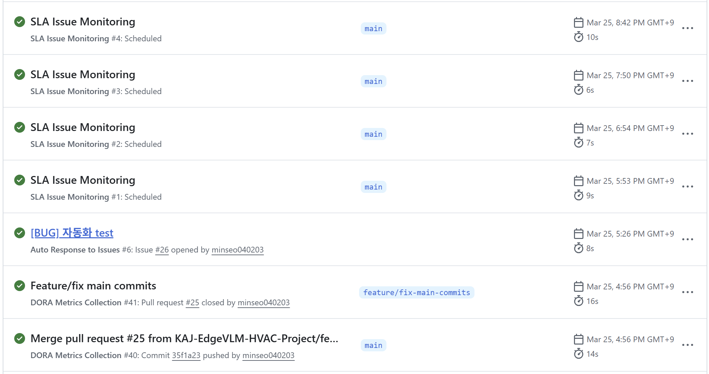
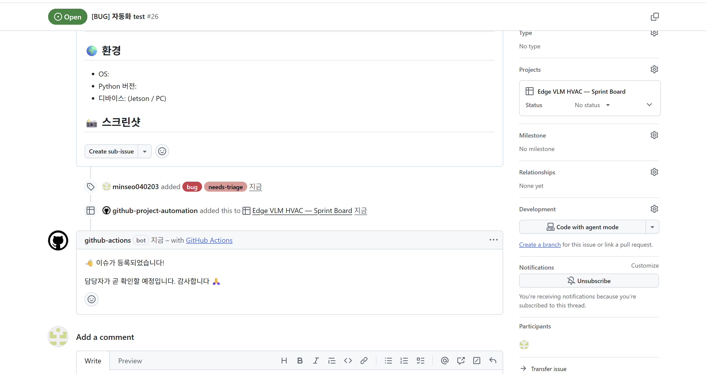

# [Week 5] GitHub Actions 기반 자동화 및 협업 개선

## ⚙️ 자동화 전략

GitHub Actions를 활용하여 반복적인 협업 작업을 자동화하고, Issue 및 프로젝트 관리 효율을 향상시켰습니다.

---

## 🤖 Issue 자동 응답 시스템

Issue 생성 시 자동으로 댓글을 등록하여 사용자에게 빠른 피드백을 제공합니다.

### ✔ 기능
- Issue 생성 시 자동 댓글 등록
- 사용자 응답 대기 시간 단축
- 협업 커뮤니케이션 개선

---

## ⏱ SLA (Service Level Agreement) 추적

정기적으로 Issue 상태를 확인하여 응답 지연 여부를 추적하는 워크플로우를 구성하였습니다.

### ✔ 기능
- 일정 주기 (cron) 기반 실행
- Issue 응답 지연 감지 기반 구조 설계
- 협업 품질 관리 기반 마련

---

## 🗂 Workflow 구성

| 파일 | 설명 |
|------|------|
| `.github/workflows/auto-response.yml` | Issue 자동 댓글 워크플로우 |
| `.github/workflows/sla-check.yml` | SLA 추적 워크플로우 |

---

## 🔄 GitHub Flow 적용

- feature 브랜치에서 작업 수행
- Pull Request를 통해 main 브랜치로 병합
- Protected Branch 정책 준수

---

## 📊 기대 효과

- 반복 작업 자동화 → 개발 생산성 향상
- Issue 대응 속도 개선 → 사용자 경험 향상
- 협업 프로세스 표준화 → 유지보수 용이

---

## 📸 스크린샷

### Actions 실행 화면

### Issue 자동 응답

### SLA 워크플로우 실행
