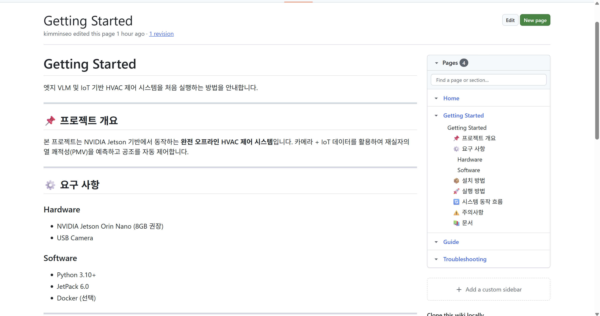
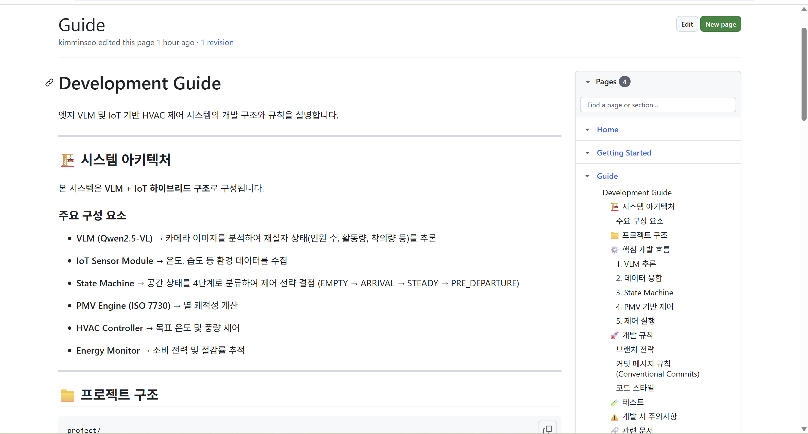
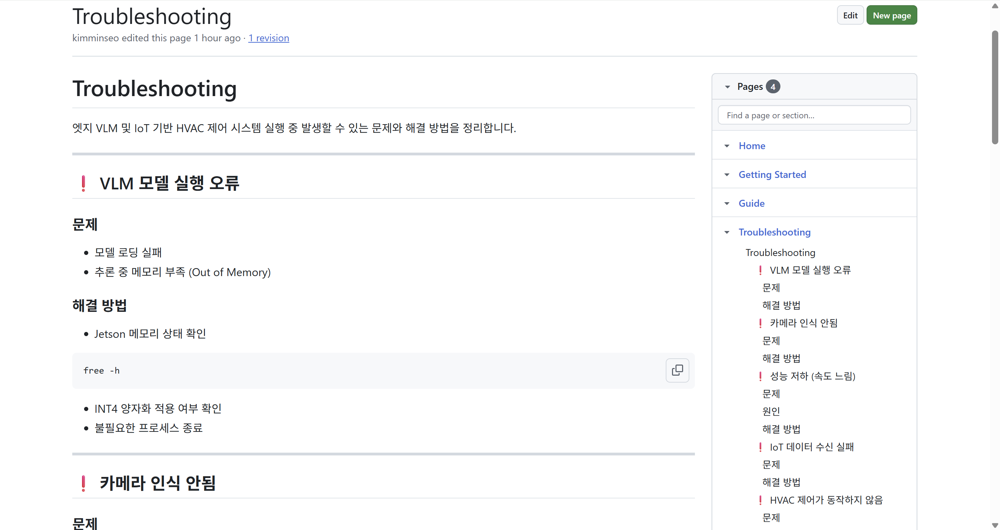
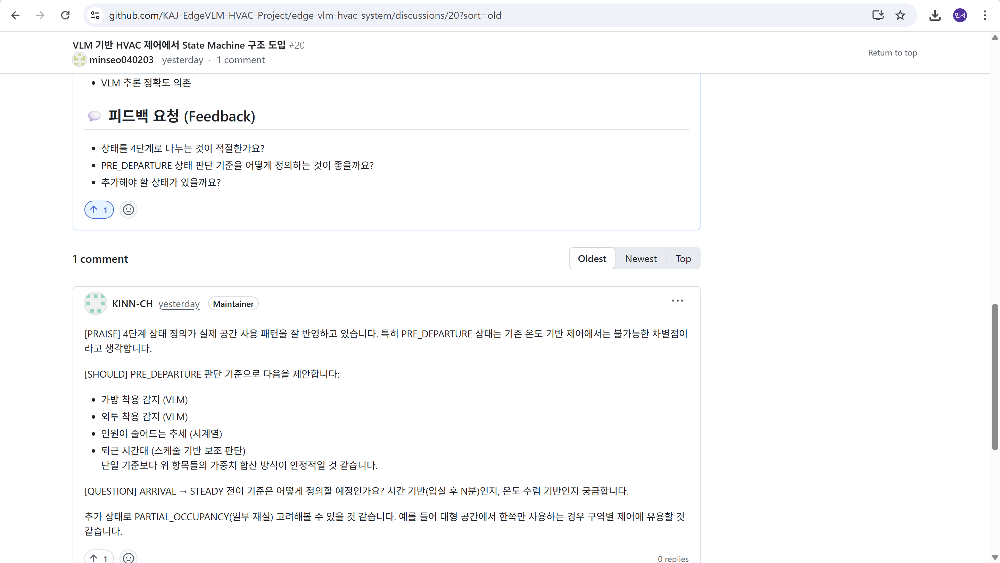
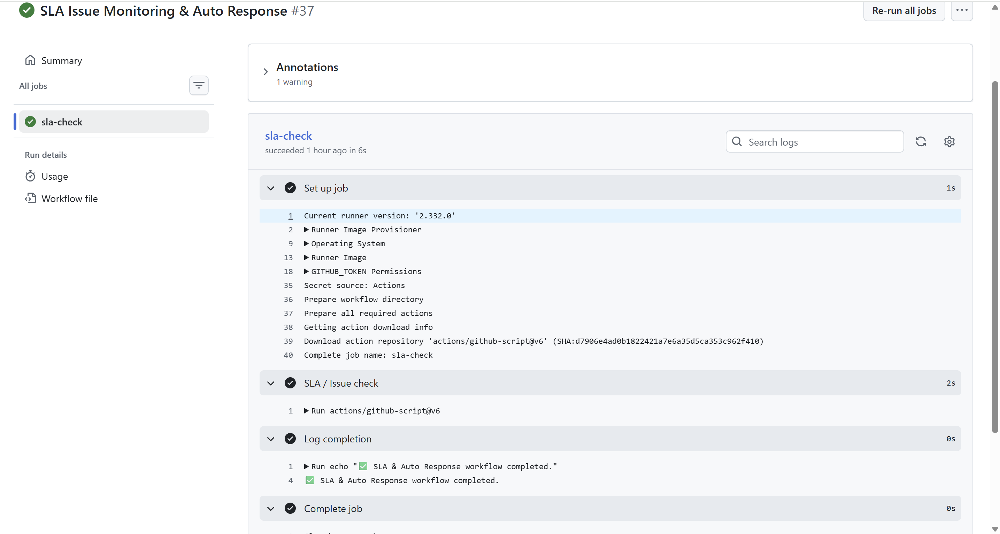
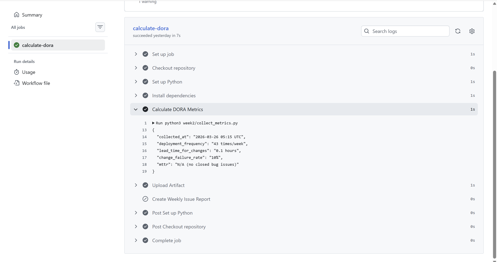

# [Week 5] GitHub Actions 자동화 및 Wiki·Discussions 구축

## 🤖 자동 응답 시스템

Issue 생성 시 자동으로 댓글을 등록하여 사용자에게 빠른 피드백을 제공합니다.

### ✔ 기능
- Issue 생성 시 자동 댓글 등록
- github-script를 활용한 이벤트 기반 처리
- 협업 커뮤니케이션 개선

---

## ⏱ SLA 추적 및 주간 요약

정기적으로 Issue 상태를 확인하여 응답 지연을 감지하고, DORA 메트릭을 자동 수집합니다.

### ✔ 기능
- 5분 주기 SLA 체크 (Cron 기반)
- 24시간 이상 미응답 Issue 감지
- 주간 DORA 메트릭 수집 및 리포팅
- 협업 품질 관리 데이터 축적

---

## 📋 기술결정기록(ADR) 및 Wiki 구축

### ADR 구조

| 파일 | 제목 | 상태 |
|------|------|------|
| `docs/adr/0001-use-vlm-for-context-awarenss.md` | VLM 기반 맥락 인지 시스템 | Accepted |
| `docs/adr/0002-use-yolo-for-people-counting.md` | 인원 수 감지를 위한 YOLOv8 도입 | Accepted |

### Wiki 문서

| 문서 | 설명 |
|------|------|
| Getting Started | 프로젝트 전체 개요 및 기본 설정 |
| Development Guide | 개발 환경 구성 및 기여 가이드 |
| Troubleshooting | 일반적인 문제 해결 및 FAQ |

---

## 🗂 Workflow 구성

| 파일 | 트리거 | 설명 |
|------|--------|------|
| `.github/workflows/auto-response.yml` | Issue 생성 | Issue 자동 댓글 등록 |
| `.github/workflows/sla-check.yml` | 5분 주기 (Cron) | SLA 모니터링 및 미응답 감지 |
| `.github/workflows/metrics.yml` | 주 1회 (월요일) | DORA 메트릭 수집 및 리포트 |

---

## 💬 GitHub Discussions

RFC(Request For Comments) 형식의 토론을 통해 아키텍처 결정사항을 공개적으로 논의합니다.

### ✔ 카테고리 설계
- Announcements: 주요 업데이트 공지
- General: 일반 질문 및 논의
- Ideas: 새로운 기능 제안
- Architecture: 기술 결정 및 RFC

---

## 📊 기대 효과

- 반복 작업 자동화 → 개발 생산성 향상
- Issue 대응 속도 개선 → SLA 준수율 향상
- 기술 결정 투명성 확보 → 공동 이해도 증진
- 메트릭 기반 팀 성과 측정 → 지속적 개선

---

## 📸 스크린샷

### Wiki 문서
  
  

### Discussions 화면
  

### Actions 실행
  
  
